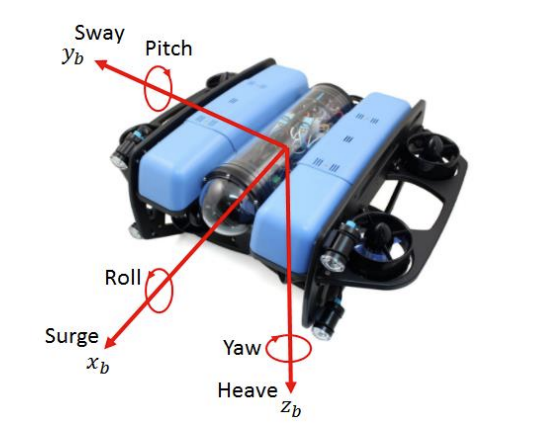

# mrobosub

Consolidated repo for the mrobosub ros network

[Check out the wiki!](https://github.com/MRoboSub/mrobosub/wiki)

## Setup

First install Docker Desktop (https://www.docker.com/)

### Windows:

Download WSL 
```console
$ wsl --install
```

Then within WSL (you can open as an application or from powershell with ```wsl```), make a folder which will hold your Robosub repositories. Within this folder git clone the repo as follows.

Clone the most recent devel branch of the mrobosub repo:
```console
$ git clone https://github.com/MRoboSub/mrobosub.git
```

You may need to setup ssh keys to clone the repo follow the following links to Generate and then Add and SSH key:

Generating SSH key - https://docs.github.com/en/authentication/connecting-to-github-with-ssh/generating-a-new-ssh-key-and-adding-it-to-the-ssh-agent?platform=linux

Adding SSH key to Github - https://docs.github.com/en/authentication/connecting-to-github-with-ssh/adding-a-new-ssh-key-to-your-github-account

Open the repository within VSCode, within the folder you can do ```code .``` or navigate within vs code.

Install the Dev Containers extension within VSCode

Make sure Docker is open, and if it is not the first time you can run the corresponding container. If it is the first time it should automatically setup when opening VS code.

When you open the repo it should ask you to reopen within container, if it does not type Ctrl+Shift+P and type ```Dev Containers: Reopen in Container```. If it is the first time this may take some time to load, if it fails to reopen in container the first time close vs code and try opening it again.


### Mac:

Make a folder where you wish to hold your robosub repositories.

Within this folder clone the most recent devel branch of the mrobosub repo:
```console
$ git clone https://github.com/MRoboSub/mrobosub.git
```

You may need to setup ssh keys to clone the repo follow the following links to Generate and then Add and SSH key:

Generating SSH key - https://docs.github.com/en/authentication/connecting-to-github-with-ssh/generating-a-new-ssh-key-and-adding-it-to-the-ssh-agent?platform=linux

Adding SSH key to Github - https://docs.github.com/en/authentication/connecting-to-github-with-ssh/adding-a-new-ssh-key-to-your-github-account

Open the repository within VSCode, within the folder you can do ```code .``` or navigate within vs code.

Install the Dev Containers extension within VSCode

Make sure Docker is open, and if it is not the first time you can run the corresponding container. If it is the first time it should automatically setup when opening VS code.

When you open the repo it should ask you to reopen within container, if it does not type Ctrl+Shift+P and type ```Dev Containers: Reopen in Container```. If it is the first time this may take some time to load, if it fails to reopen in container the first time close vs code and try opening it again.

## Running Files

Note: If it has been a while or the first time you may need to run `catkin build` to create some autogenerated code and compilation

The typical way we run files is either with `rosrun` or `roslaunch`. The standard syntax is ```roslaunch <package_name> <launch_file>```.

To run the whole state machine with standard run for example the command with be `roslaunch mrobosub_planning captain.launch`.


## Dependencies Install
```console
$ rosdep install --from-paths src --ignore-src -r -y
```
Be in `~/catkin_ws` and installs all dependencies for ros


## RQT

To run RQT in the Docker, you need to setup an XServer.

### Windows

1. Download and install [VcXsrv](https://sourceforge.net/projects/vcxsrv/)
2. The program to run is called "XLaunch." When running it, make sure to check "Disable access control"

### Mac

Instructions based on [this GitHub Gist comment](https://gist.github.com/cschiewek/246a244ba23da8b9f0e7b11a68bf3285?permalink_comment_id=3477013#gistcomment-3477013)

1. Download and install [XQuartz](https://www.xquartz.org/)
2. Run XQuartz and open Settings. In the security tab, enable "Allow connections from network clients". Then Restart XQuartz
3. Run the following commands in the XQuartz terminal. 
You may need to run these commands each time you start XQuartz

        export DISPLAY=:0
        /opt/X11/bin/xhost +

## Package Structure

- `mrobosub` - The metapackage which depends on all other packages. Only need to modify this when creating a new package
- `mrobosub_fcu` - The flight controller unit (FCU) package. Handles mixing together thrusters and sensors to determine how to move the submarine in the desired direction.
- `mrobosub_gnc` - The guidance navigation and control (GNC) package. Handles higher level control of the submarine, such heading control and depth control, via feedback loops.
- `mrobosub_hal` - The hardware abstraction layer (HAL) package. Contains code that directly interfaces with the hardware devices.
- `mrobosub_localization` - The localization package. Estimates the submarine's location relative to its enviornment.
- `mrobosub_msgs` - The messages package. Contains all the custom ROS message types created for the `mrobosub` project. Most packages depend on `mrobosub_msgs`.
- `mrobosub_perception` - The perception package. Handles retrieving images from the cameras and processing them via classical CV (computer vision) and ML (machine learning) to determine where objects are located relative to the submarine.
- `mrobosub_planning` - Contains the high level state machine that determines what the submarine should be doing at all times.

## Coordinate System




## Computer Setup


### Persistent Bottom Camera Device Name

In `/etc/udev/rules.d`, add a file named `25-myvideorules.rules` with the following content

```
SUBSYSTEM=="video4linux", ATTRS{name}=="H264 USB Camera: USB Camera", ATTRS{index}=="0", SYMLINK+="botcam"
```

If the name of the camera is different, find it by running

```
udevadm info -a -p $(udevadm info -q path -p /class/video4linux/video0)
```

Where `video0` is the capture device name under `/dev` (for example, `/dev/video0`)

Then restart or run

```
sudo udevadm control --reload-rules && udevadm trigger
```

The camera will now be available under `/dev/botcam`

## Messages

### Wildcards

The string `*6dof` in a topic name indicates that there exists 6 topics, one for each degree of freedom (DOF). The DOF replaces `*6dof` in each topic name. The DOF's are:
- `surge`
- `sway`
- `heave`
- `roll`
- `pitch`
- `yaw`

The string `*object`  in a topic name indicates that there exists a topic for each type of object that we are interested in. The object names are currently:
- `gate`

### Topics

- `/raw_imu (sensor_msgs/Imu)`
    - raw IMU data (oritentation, etc)
- `/raw_depth (std_msgs/Float64)`
    - raw depth (m) (TODO is this positive or negative when descending?)
- `/target_pose/*6dof (std_msgs/Float64)`
    - desired position
- `/target_twist/*6dof (std_msgs/Float64)`
    - desired speeds
- `/output_wrench/*6dof (std_msgs/Float64)`
    - force on each DOF to send to the FCU
- `/pose/*6dof`
    - current pose
- `/obj_psn/*object (mrobosub_msgs/ObjectPosition)`
    - information about location of object on the screen and distance from the UAV

### Services
- `/obj_enable/*object (std_srvs/SetBool)`
    - determines if an object's information should be published or not. If set to `false`, nothing should be published to `/obj_psn/*object`
