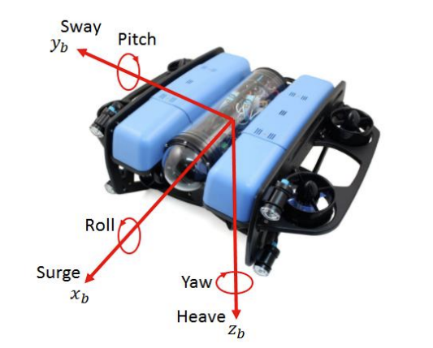

# mrobosub

Consolidated repo for the mrobosub ros network

This document was last updated January 2026

[Check out the wiki!](https://github.com/MRoboSub/mrobosub/wiki)

# Index
- [Logistics](#logistics)
- [Codebase Setup](#codebase-setup)
  - [Set up Docker Desktop (and potentially WSL)](#set-up-docker-desktop-and-potentially-wsl)
    - [Windows](#windows)
      - [Installing Docker Desktop](#installing-docker-desktop)
      - [Installing Ubuntu 24.04](#installing-ubuntu-2404)
    - [MacOS (Linux should be similar)](#macos-linux-should-be-similar)
    - [(Optional) Test Docker installation](#optional-test-docker-installation)
  - [Set up SSH key & Clone Repo](#set-up-ssh-key--clone-repo)
  - [Build and reopen in docker container](#build-and-reopen-in-docker-container)
  - [(Optional) Try RQT](#optional-try-rqt)
    - [Windows](#windows-1)
    - [Mac](#mac)
- [The Basics](#the-basics)
  - [Package Structure](#package-structure)
  - [Coordinate System](#coordinate-system)
  - [You can stop here!! :)](#you-can-stop-here!!)
  - [Computer Setup](#computer-setup)
  - [Persistent Bottom Camera Device Name](#persistent-bottom-camera-device-name)
  - [Messages](#messages)
    - [Wildcards](#wildcards)
    - [Topics](#topics)
    - [Services](#services)
    
# Logistics

* Ask to be added to the Slack
* Ask to be added to the Google drive
* Find out when the weekly software subteam meeting is and try to attend that too!

# Codebase Setup

In order to run ROS2 nodes in an environment as similar to the sub as posible while running seamlessly on any computer we develop in a container. We run this container with Docker (podman is another option but is slightly more complicated to get running). Setting up the dev enitonment is slightly different by platform but the steps for all platforms are below and after getting the container configured everything is identical across platforms.

## Set up Docker Desktop (and potentially WSL)
### Windows

#### Installing Docker Desktop
1. Download the Docker Desktop installer from [the official website](https://docs.docker.com/desktop/setup/install/windows-install/)
1. Run the installer and make sure to select the WSL 2 backend, this should be the default
1. After the installer finishes launch `Docker Desktop`
1. If it asks you to sign in you can either create an account or skip, this does not matter for our use case

#### Installing Ubuntu 24.04
1. Open a powershell window
1. In the terminal enter
    ```
    wsl --install Ubuntu-24.04
    ```
1. This will install Ubuntu 24 in WSL, while this isn't strictly necessary it is beneficial for consistency.
1. Open Docker Desktop and in the top right click the setting cog, navigate to the `Resources` tab on the left and the `WSL integration` tab along the top.
1. You should ensure that the checkbox is enabled and the switch next to `Ubuntu-24.04` is also on
   

1. To verify this is configured correctly open `Ubuntu 24.04`, this should launch you a terminal in your WSL Ubuntu instance, you will type all commands in here from now on

### MacOS (Linux should be similar)
MacOS is a lot easier than Windows, we just need to install Docker Desktop.

1. Install Docker Desktop from [the official website](https://docs.docker.com/desktop/setup/install/mac-install/)
1. Follow the instructions in [Test Docker Installation](#test-docker-installation)

### (Optional) Test Docker installation
1. Run `docker run --rm hello-world:latest`
1. The output should look like this, if it doesn't find a returning member to help troubleshoot or send a message in the slack
    ```
    Hello from Docker!
    This message shows that your installation appears to be working correctly.

    To generate this message, Docker took the following steps:
    1. The Docker client contacted the Docker daemon.
    2. The Docker daemon pulled the "hello-world" image from the Docker Hub.
        (amd64)
    3. The Docker daemon created a new container from that image which runs the
        executable that produces the output you are currently reading.
    4. The Docker daemon streamed that output to the Docker client, which sent it to your terminal.

    To try something more ambitious, you can run an Ubuntu container with:
    $ docker run -it ubuntu bash

    Share images, automate workflows, and more with a free Docker ID:
    https://hub.docker.com/

    For more examples and ideas, visit:
    https://docs.docker.com/get-started/
    ```

## Set up SSH key & Clone Repo
Now that everyone is running on a POSIX compatible system (WSL on Windows, MacOS, or Linux) we can all follow the same install directions.

1. Configure SSH keys with GitHub
    First, create an ssh private key
    ```sh
    ssh-keygen -t ed25519 -C "your@email.com"
    ```
    You can put a password on it if you like but you should save it at the default location. Now add this key to your ssh agent
    ```sh
    eval "$(ssh-agent -s)"
    ssh-add ~/.ssh/id_ed25519
    ```
    Finally print out your key and add it to your GitHub account
    ```sh
    cat ~/.ssh/id_ed25519.pub
    ```
    You can upload it to your GitHub account [here](https://github.com/settings/keys)

2. Now we can finally clone the repository and open it in VSCode
    ```sh
    cd ~
    git clone -b ros2 git@github.com:MRoboSub/mrobosub.git
    cd mrobosub
    code .
    ```
3. We have some submodules (i.e., external git repositories that we link to as a subfolder in our repository). Pull these by running
```git submodule update --init --recursive```


## Build and reopen in docker container
1. Build a docker image. Run ```docker build -t mrobosub/mrobosub2 .``` from the mrobosub directory.  Don't forget the dot (.) at the end of the command.
If this gives you an error and you're on a Mac, run ```docker buildx build --platform linux/amd64,linux/arm64 -t mrobosub/mrobosub2 .``` instead
2. Make sure you have the`Dev Containers` extension installed on VS Code. If you see a pop-up in the bottom right of VS code that you are working in a repository with a devcontainer, you can click the option to reopen in the container. Otherwise, press `ctrl+shift+p` (cmd + shift+p on mac) to open the options at the top of VS code and click `Dev Containers: reopen in container`

Now you should be a in a new VS code window where the bottom left says `Dev Container: Michigan RoboSub ...`

### You are done! You should be able to build code and run ros nodes now.

* Running `build` in the command line will build all nodes and install them, you should use this instead of colcon directly

* Check out [this doc](https://docs.google.com/document/d/1Vbe4RTdNurBaaiNRwxe_2l4hplVALOXEP0juPbmEu1U/edit?tab=t.0#heading=h.8b8ukcicps0b) for some handy commands you can use to run ros2 nodes, see what is being published to various topics from the command-line etc.

* Note: When you need to run git commands, you may need to run `git pull` and `git push` from your system terminal and not the VSCode terminal within the dev container (if you need to enter a username and password everytime you run a git command this might be the issue)

* Note: Whenever you actually want to push code to this github repo for the first time, you'll need to ask a software lead to give you write access to the github repository.

## (Optional) Try RQT

You can skip this step unless you're specifically trying to use RQT for something.

To run RQT in the Docker, you need to setup an XServer.

### Windows

1. Download and install [VcXsrv](https://sourceforge.net/projects/vcxsrv/)
2. The program to run is called "XLaunch." When running it, make sure to check "Disable access control"

### Mac

Instructions based on [this GitHub Gist comment](https://gist.github.com/cschiewek/246a244ba23da8b9f0e7b11a68bf3285?permalink_comment_id=3477013#gistcomment-3477013)

1. Download and install [XQuartz](https://www.xquartz.org/)
2. Run XQuartz and open Settings. In the security tab, enable "Allow connections from network clients". Then Restart XQuartz
3. Run the following commands in the XQuartz terminal. 
You may need to run these commands each time you start XQuartz

        export DISPLAY=:0
        /opt/X11/bin/xhost +

# The Basics

## Package Structure

- `mrobosub` - The metapackage which depends on all other packages. Only need to modify this when creating a new package
- `mrobosub_hal` - The hardware abstraction layer (HAL) package. Contains code that directly interfaces with the hardware devices such as reading from sensors and sending the last-mile commands to thrusters (thruster_controller.py)
- `mrobosub_hal_imu` - Contains third-party code that reads data from the IMU directly
- `mrobosub_localization` - The localization package. Reads data published from sensors and estimates the submarine's location relative to its enviornment.
- `mrobosub_planning` - Contains the high level state machine that determines what the submarine should be doing at all times.
- `mrobosub_gnc` - The guidance navigation and control (GNC) package. Takes in current pose and target pose and uses PID to get us to the target pose.
- `mrobosub_fcu` - The flight controller unit (FCU) package. Handles thruster mixing (i.e., if our goal is to move forward, how should each of the 8 thrusters be rotated clockwise or anticlockwise to make this happen?)
- `mrobosub_msgs` - The messages package. Contains all the custom ROS message types created for the `mrobosub` project. Most packages depend on `mrobosub_msgs`.
- `mrobosub_perception` - The perception package. Handles retrieving images from the cameras and processing them via classical CV (computer vision) and ML (machine learning) to determine where objects are located relative to the submarine.


## Coordinate System



We have 3 axes (x, y, and z). Along each axis we can perform linear motion or we can rotate about that axis. E.g.:  motion along x-axis is called surge, motion along z-axis is called heave, and rotation about the z-axis (i.e, when you look down at the robot and it rotates clockwise or anticlockwise) is called yaw.

## Intro to the robot hardware and ROS

This is a [useful presentation](https://docs.google.com/presentation/d/141jVQOuEV9UzF67p5QG6_tU4PZVhQLVOzdn9fqWVdtQ/edit?usp=drive_link) that walks through the competition tasks, the various electronics on the robot, as well as ROS basics.

## You Can Stop Here!!

Everything below this point may be outdated, so you can pause the onboarding here and ask team members for help. We'll work on updating the information below.

## Computer Setup


### Persistent Bottom Camera Device Name

In `/etc/udev/rules.d`, add a file named `25-myvideorules.rules` with the following content

```
SUBSYSTEM=="video4linux", ATTRS{name}=="H264 USB Camera: USB Camera", ATTRS{index}=="0", SYMLINK+="botcam"
```

If the name of the camera is different, find it by running

```
udevadm info -a -p $(udevadm info -q path -p /class/video4linux/video0)
```

Where `video0` is the capture device name under `/dev` (for example, `/dev/video0`)

Then restart or run

```
sudo udevadm control --reload-rules && udevadm trigger
```

The camera will now be available under `/dev/botcam`

## Messages

### Wildcards

The string `*6dof` in a topic name indicates that there exists 6 topics, one for each degree of freedom (DOF). The DOF replaces `*6dof` in each topic name. The DOF's are:
- `surge`
- `sway`
- `heave`
- `roll`
- `pitch`
- `yaw`

The string `*object`  in a topic name indicates that there exists a topic for each type of object that we are interested in. The object names are currently:
- `gate`

### Topics

- `/raw_imu (sensor_msgs/Imu)`
    - raw IMU data (oritentation, etc)
- `/raw_depth (std_msgs/Float64)`
    - raw depth (m) (TODO is this positive or negative when descending?)
- `/target_pose/*6dof (std_msgs/Float64)`
    - desired position
- `/target_twist/*6dof (std_msgs/Float64)`
    - desired speeds
- `/output_wrench/*6dof (std_msgs/Float64)`
    - force on each DOF to send to the FCU
- `/pose/*6dof`
    - current pose
- `/obj_psn/*object (mrobosub_msgs/ObjectPosition)`
    - information about location of object on the screen and distance from the UAV

### Services
- `/obj_enable/*object (std_srvs/SetBool)`
    - determines if an object's information should be published or not. If set to `false`, nothing should be published to `/obj_psn/*object`
