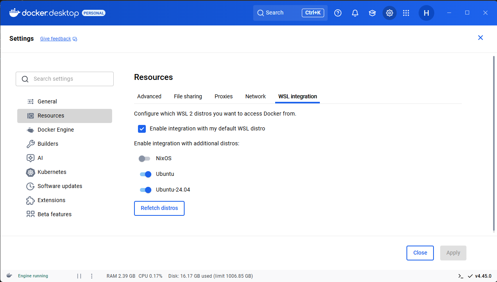

# Configuring Development Workspace

In order to run ROS2 nodes in an environment as similar to the sub as posible while running seamlessly on any computer we devlop in a container. We run this container with Docker (podman is another option but is slightly more complicated to get running). Setting up the dev enitonment is slightly different by platform but the steps for all platforms are below and after getting the container configured everything is identical across platforms.

## Windows

### Installing Docker Desktop
1. Download the Docker Desktop installer from [the official website](https://docs.docker.com/desktop/setup/install/windows-install/)
1. Run the installer and make sure to select the WSL 2 backend, this should be the default
1. After the installer finishes launch `Docker Desktop`
1. If it asks you to sign in you can either create an account or skip, this does not matter for our use case

### Installing Ubuntu 24.04
1. Open a powershell window
1. In the terminal enter
    ```
    wsl --install Ubuntu-24.04
    ```
1. This will install Ubuntu 24 in WSL, while this isn't strictly necessary it is beneficial for consistency.
1. Open Docker Desktop and in the top right click the setting cog, navigate to the `Resources` tab on the left and the `WSL integration` tab along the top.
1. You should ensure that the checkbox is enabled and the switch next to `Ubuntu-24.04` is also on
    
1. To verify this is configured correctly open `Ubuntu 24.04`, this should launch you a terminal in your WSL Ubuntu instance, you will type all commands in here from now on

## Test Docker installation
1. Run `docker run --rm hello-world:latest`
1. The output should look like this, if it doesn't find a returning member to help troubleshoot or send a message in the slack
    ```
    Hello from Docker!
    This message shows that your installation appears to be working correctly.

    To generate this message, Docker took the following steps:
    1. The Docker client contacted the Docker daemon.
    2. The Docker daemon pulled the "hello-world" image from the Docker Hub.
        (amd64)
    3. The Docker daemon created a new container from that image which runs the
        executable that produces the output you are currently reading.
    4. The Docker daemon streamed that output to the Docker client, which sent it to your terminal.

    To try something more ambitious, you can run an Ubuntu container with:
    $ docker run -it ubuntu bash

    Share images, automate workflows, and more with a free Docker ID:
    https://hub.docker.com/

    For more examples and ideas, visit:
    https://docs.docker.com/get-started/
    ```

Now move on to [All Operating Systems](#all-operating-systems)

## MacOS
MacOS is a lot easier than Windows, we just need to install Docker Desktop.

1. Install Docker Desktop from [the official website](https://docs.docker.com/desktop/setup/install/mac-install/)
1. Follow the instructions in [Test Docker Installation](#test-docker-installation)

## Linux
If you daily drive Linux im pretty sure you can setup Docker, if not ask for help, many of us have linux experience.


## All Operating Systems
See, there is a method to our madness. Now that everyone is running on a POSIX compatible system (WSL on Windows, MacOS, or Linux) we can all follow the same install directions.

1. Configure SSH keys with GitHub
    First, create an ssh private key
    ```sh
    ssh-keygen -t ed25519 -C "your@email.com"
    ```
    You can put a password on it if you like but you should save it at the default location. Now add this key to your ssh agent
    ```sh
    ssh-add ~/.ssh/id_ed25519
    ```
    Finally print out your key and add it to your GitHub account
    ```sh
    cat ~/.ssh/id_ed25519.pub
    ```
    You can upload it to your GitHub account [here](https://github.com/settings/keys)

1. Now we can finally clone the repository and open it in VSCode
    ```sh
    cd ~
    git clone -b ros2 git@github.com:MRoboSub/mrobosub.git
    cd mrobosub
    code .
    ```

1. VSCode should tell you in the bottom right of the window that you are working in a repository with a devcontainer, you can click the option to reopen in the container.
If you do not see this popup make sure you have the `Dev Containers` extension installed.
When you click on the popup you should soon be in a new window where the bottom left says `Dev Container: Michigan RoboSub ...` if not, ask a returning member or send a message in Slack

### You are done, everyone should now be able to run ros nodes and build code

Some tips and tricks I find useful
* Running `build` in the command line will build all nodes and install them, you should use this instead of colcon directly
* You may need to run `git pull` and `git push` from your system terminal not the VSCode terminal, if you need to enter a username and password everytime you run a git command this might be the issue
